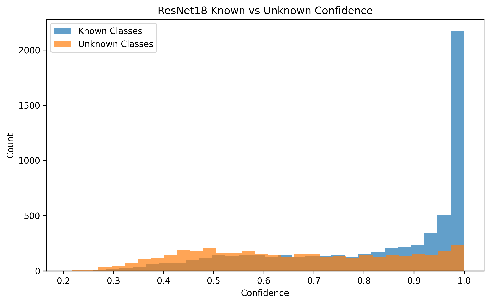
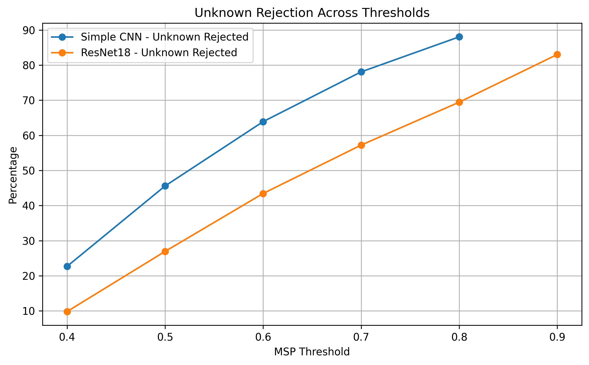
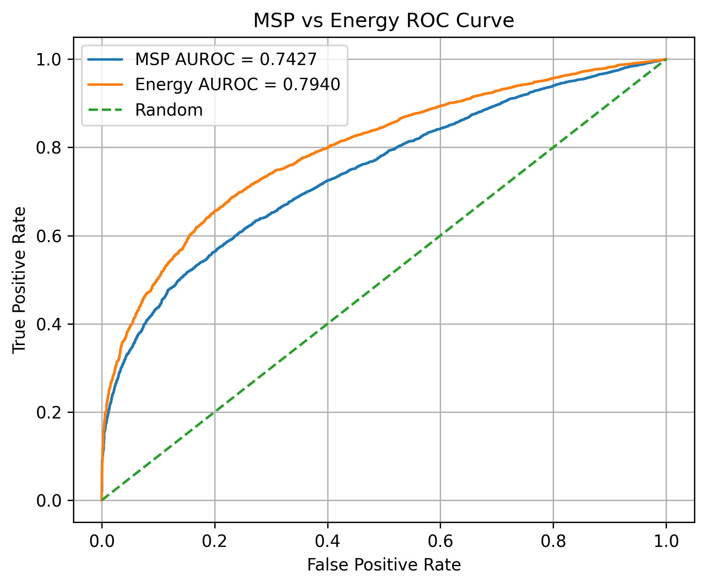
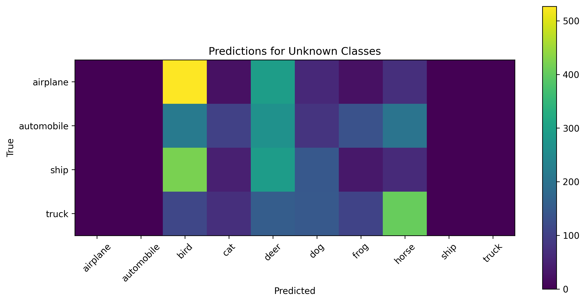

# OOD Research Project

This project explores image classification confidence and simple out-of-distribution (OOD) behavior using PyTorch.

The experiments use CIFAR-10, starting from baseline classifiers and moving toward known vs unknown class evaluation.

## Current Work

- Loading and visualizing CIFAR-10
- Training and evaluating baseline image classification models
- Saving and loading trained model checkpoints
- Measuring prediction confidence with softmax
- Comparing confidence for correct and incorrect predictions
- Training models on selected known classes only
- Treating the remaining classes as unknown during evaluation
- Testing Maximum Softmax Probability (MSP) as a simple OOD baseline
- Comparing several OOD scores, including MSP, Energy, Max Logit, and Logit Margin
- Tracking experiments in `experiment_log.md`

## Current Results

| Model | Training Setup | Test Accuracy |
|---|---|---:|
| Fully Connected Neural Network | CIFAR-10, all classes | 43.36% |
| Simple CNN | CIFAR-10, all classes | 64.05% |
| ResNet18 | CIFAR-10, all classes, normalization | 76.47% |
| ResNet18 | CIFAR-10, augmentation, Adam, StepLR, 20 epochs | 83.07% |
| Simple CNN | Known classes only | 61.02% |
| ResNet18 | Known classes only, improved training recipe | 79.70% |

## Confidence Analysis

For the Simple CNN trained on all CIFAR-10 classes:

| Prediction Type | Average Confidence |
|---|---:|
| Correct predictions | 0.739 |
| Wrong predictions | 0.530 |

The model is usually more confident when predictions are correct, but there is still overlap between correct and incorrect predictions.

## Known vs Unknown Experiment

For the OOD-style experiment, the models were trained only on six CIFAR-10 animal classes:

- bird
- cat
- deer
- dog
- frog
- horse

The remaining vehicle classes were treated as unknown during evaluation:

- airplane
- automobile
- ship
- truck

Average softmax confidence:

| Model | Known Confidence | Unknown Confidence |
|---|---:|---:|
| Simple CNN | 0.631 | 0.552 |
| ResNet18, earlier setup | 0.861 | 0.753 |
| ResNet18, improved setup | 0.829 | 0.661 |

The improved ResNet18 model increased known-class accuracy and reduced average confidence on unknown samples, although confidence overlap still remains.

## MSP Thresholding

Maximum Softmax Probability (MSP) was used as a simple baseline for unknown detection.

A sample is treated as unknown when its maximum softmax confidence is below a selected threshold.

At threshold `0.8`:

| Model | Known Accepted | Unknown Rejected |
|---|---:|---:|
| Simple CNN | 25.47% | 88.05% |
| ResNet18, earlier setup | 71.37% | 51.88% |
| ResNet18, improved setup | 65.35% | 69.45% |

This shows the trade-off between accepting known samples and rejecting unknown samples. The improved ResNet18 setup rejects more unknown samples than the earlier ResNet18 setup, but still does not fully separate known and unknown samples using MSP alone.

## OOD Score Comparison

AUROC was calculated using several OOD scores on the improved known-only ResNet18 model.

Known samples were labeled as `1`, and unknown samples were labeled as `0`.

| OOD Score | AUROC |
|---|---:|
| MSP confidence | 0.7427 |
| Energy score, T=1 | 0.7917 |
| Energy score, T=2 | 0.7940 |
| Max logit | 0.7862 |
| Logit margin | 0.7195 |

Energy-based scoring gave the best AUROC in this setup, with a small improvement from using temperature `T=2`.

## FPR@95TPR

FPR@95TPR was calculated to evaluate unknown detection when the known-class true positive rate is around 95%.

| OOD Score | FPR@95TPR |
|---|---:|
| MSP confidence | 0.8315 |
| Energy score, T=2 | 0.7745 |

Energy reduced the false positive rate compared with MSP, but both scores still accepted many unknown samples as known.

## Unknown Class Predictions

The Simple CNN trained only on known animal classes often maps unknown vehicle classes into known animal classes.

Examples from the confusion matrix:

- airplane → bird
- ship → bird
- truck → horse

This suggests that the model assigns unknown samples to the closest known classes instead of recognizing them as unseen.

## Observations

- ResNet18 performs better than the Simple CNN on known-class classification.
- Better classification accuracy does not automatically solve overconfidence on unknown samples.
- Data augmentation, longer training, and a learning rate scheduler improved ResNet18 accuracy.
- The improved ResNet18 setup reduced average unknown confidence compared with the earlier ResNet18 setup.
- MSP thresholding shows a clear trade-off between accepting known samples and rejecting unknown samples.
- Energy-based scoring performed better than MSP in this setup, but the separation between known and unknown samples is still not complete.

## Next Steps

- Add feature-distance based OOD scoring
- Explore calibration methods such as temperature scaling
- Refactor repeated dataset/model code into reusable modules

## Tools

- Python
- PyTorch
- Torchvision
- Scikit-learn
- Matplotlib
- NumPy
- Git / GitHub